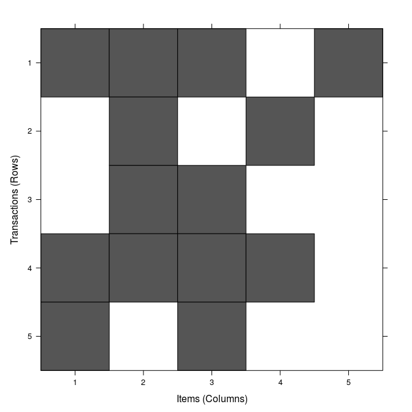

# Association rules

[Association rules](https://en.wikipedia.org/wiki/Association_rule_learning) mean finding the items that group together more frequently. It is a method for discovering relations between variables. This algorithms are used in shops to figure out which products are usually sell together to make recommendations. For example if you buy sausage and hotdog bread you may need to buy ketchup or mustard.


## Definitions

### Items

Items are binary attributes that can or not belong to a transaction. Each transaction has a unique identifier. For example a transaction can be a purchase in a shop, and the items of that transaction are *Sausages* and *Mustard*.
$$I={i_1,i_2,...,i_n}$$ is the collection of all the available items.
$$D={t_1,t_2,....t_m}$$ is the set of all the transactions.

### Rule

A rule is an implication of the form $$X \Rightarrow Y$$ where $$X,Y \subseteq  I$$ and $$X \cap Y=\varnothing$$. The itemsets X is the *antecedent* (left-hand-side or LHS) and Y is the *consequent* (right-hand-side or RHS).


### Support

The *support* of an itemset is defined as the proportions of *transactions T* in the *dataset D* which contains that *itemset*. This is:
\\[
supp(X)=\frac{\left | \left \\{ T \in D | X \subseteq T \right \\} \right | }{\left | D  \right |}
\\]
This is can be considered an estimate of P(X), the probability to find this *itemset* in the transactions dataset.

### Confidence

The *confidence* indicates how often the rule is accomplished, it is defined as:
\\[
conf(X \Rightarrow Y)=\frac{supp(X \cup Y)}{supp(X)}
\\]
Which is estimate an of $$P(Y|X)=\frac{P(Y,X)}{P(X)}$$

### Lift

Another measure is the *lift* which can be interpreted as the deviation of the support of the whole rule from the support expected under independence given the supports of the LHS and the RHS. Greater lift values indicate stronger associations. 


\\[
lift(X \Rightarrow Y)=\frac{supp(X \cup Y)}{supp(X)·supp(Y)}
\\]


## Apriori

This is by far the most popular associative algorithm. This algorithm can be described in the following steps:
1. We start with the complete list of itemsets and extract all the items.
2. With all the items create a list of itemsets of only one item.
3. Calculate the Support from each of the itemsets.
4. Remove the itemsets with a support value lower than the user defined threshold.
5. Increase the remaining itemsets with one new item, with all the possible combinations.
6. Goto 3 until all the itemsets in the original list has been inspected.

First we need to define a support value. In this case we will set it to 0.4.

Let's assume that we have in the database the following itemsets:

{: .table-border}
| Itemset| Support |
|--------|---------|
| Itemset A | Item1, Item2, Item3, Item5 |
| Itemset B | Item2, Item4 |
| Itemset C | Item2, Item3 |
| Itemset D | Item1, Item2, Item3, Item4 |
| Itemset E | Item1, Item3 |

We create a list of itemsets with only one item, and select only those with a support value higher than our predefined threshold:

{: .table-border}
| Itemset| Support |
|-------|---------|
| **Item1** | **$$ \frac{3}{5}=0.6 $$** |
| **Item2** | **$$ \frac{4}{5}=0.8 $$** |
| **Item3** | **$$ \frac{4}{5}=0.8 $$** |
| **Item4** | **$$ \frac{2}{5}=0.4 $$** |
| _Item5_ | _$$ \frac{1}{5}=0.2 $$_ |

Then with the itemsets that passed that threshold we continue and add another element to create a longer itemsets:

{: .table-border}
| Itemset| Support |
|-------|---------|
| **{Item1, Item2}** | **$$ \frac{2}{5}=0.4 $$** |
| **{Item1, Item3}** | **$$ \frac{3}{5}=0.6 $$** |
| {Item1, Item4} | $$ \frac{1}{5}=0.2 $$ |
| **{Item2, Item3}** | **$$ \frac{3}{5}=0.6 $$** |
| **{Item2, Item4}** | **$$ \frac{2}{5}=0.4 $$** |
| {Item3, Item4} | $$ \frac{1}{5}=0.2 $$ |

We repeate once again, this time with a itemsets of length 3:

{: .table-border}
| Itemset| Support |
|-------|---------|
| **{Item1, Item2, Item3}** | $$ \frac{2}{5}=0.4 $$ |
| {Item1, Item2, Item4} | $$ \frac{1}{5}=0.2 $$ |
| {Item1, Item3, Item4} | $$ \frac{1}{5}=0.2 $$ |
| {Item2, Item3, Item4} | $$ \frac{1}{5}=0.2 $$ |


Now we collect a list of all the itemsets above the threshold:
{Item1},{Item2},{Item3},{Item4},{Item1,Item2},{Item1,Item3},{Item2,Item3},{Item2,Item4},{Item1,Item2,Item3,Item4}.
From which we can infer the following rules with only one element in the RHS:

{: .table-border}
| Left hand side| Right hand side | Support | Confidence | Lift |
|--------------|-----------------|---------|------------|-------|
| {}           | {Item1}         | 3/5=0.6 |  3/5=0.6   | 1    |
| {}           | {Item2}         | 4/5=0.8 |  4/5=0.8   | 1    |
| {}           | {item3}         | 4/5=0.8 |  4/5=0.8   | 1    |
| {}           | {item4}         | 2/5=0.4 |  2/5=0.4   | 1    |
| {item1}      | {item2}         | 2/5=0.4 |  2/3=0.6666667| 5 * 2 /(3 * 4)=0.8333333|  
| {item2}      | {item1}         | 2/5=0.4 |  2/4=0.5   | 5 * 2 / (3 * 4)=0.8333333 |
| {item1}      | {item3}         | 3/5=0.6 |  3/3=1     | 5 * 3 / (3 * 4)=1.25|
| {item3}      | {item1}         | 3/5=0.6 |  3/4=0.75  | 5 * 3 / (3 * 4)=1.25|
| {item2}      | {item3}         | 3/5=0.6 |  3/4=0.75  | 5 * 3 / (4 * 4)=0.9375|
| {item3}      | {item2}         | 3/5=0.6 |  3/4=0.75  | 5 * 3 / (4 * 4)=0.9375|
| {item2}      | {item4}         | 2/5=0.4 |  2/4=0.5   | 5 * 2 / (4 * 2)=1.25|
| {item4}      | {item2}         | 2/5=0.4 |  2/2=1     | 5 * 2 / (4 * 2)=1.25|
| {item1,item2}| {item3}         | 2/5=0.4 |  2/2=1     | 5 * 2 / (2 * 4)=1.25|
| {item1,item3}| {item2}         | 2/5=0.4 |  2/3=0.6666667| 5 * 2 / ( 3 * 4 )=0.8333333|
| {item2,item3}| {item1}         | 2/5=0.4 |  2/3=0.6666667| 5 * 2 / ( 3 * 3 )=1.1111111|


The R code to calculate this Apriori rules follows:

```R
> item1<-c(T,F,F,T,T)
> item2<-c(T,T,T,T,F)
> item3<-c(T,F,T,T,T)
> item4<-c(F,T,F,T,F)
> item5<-c(T,F,F,F,F)
> library(arules)
> trans<-as(data.frame(item1,item2,item3,item4,item5),"transactions")
> inspect(trans)
    items                     transactionID
[1] {item1,item2,item3,item5} 1            
[2] {item2,item4}             2            
[3] {item2,item3}             3            
[4] {item1,item2,item3,item4} 4            
[5] {item1,item3}             5    
> image(trans)
```

```R
> rules<-apriori(trans, parameter=list(support=0.4, confidence=0,minlen=2),
         control = list(verbose=F))
> inspect(rules)
     lhs              rhs     support confidence lift     
[1]  {}            => {item4} 0.4     0.4000000  1.0000000
[2]  {}            => {item1} 0.6     0.6000000  1.0000000
[3]  {}            => {item2} 0.8     0.8000000  1.0000000
[4]  {}            => {item3} 0.8     0.8000000  1.0000000
[5]  {item4}       => {item2} 0.4     1.0000000  1.2500000
[6]  {item2}       => {item4} 0.4     0.5000000  1.2500000
[7]  {item1}       => {item2} 0.4     0.6666667  0.8333333
[8]  {item2}       => {item1} 0.4     0.5000000  0.8333333
[9]  {item1}       => {item3} 0.6     1.0000000  1.2500000
[10] {item3}       => {item1} 0.6     0.7500000  1.2500000
[11] {item2}       => {item3} 0.6     0.7500000  0.9375000
[12] {item3}       => {item2} 0.6     0.7500000  0.9375000
[13] {item1,item2} => {item3} 0.4     1.0000000  1.2500000
[14] {item1,item3} => {item2} 0.4     0.6666667  0.8333333
[15] {item2,item3} => {item1} 0.4     0.6666667  1.1111111

```

A more practical exercise can be done using the Titanic dataset from Kaggle. This file contains passenger list of the people in the Titanic with some extra data like age, class, boarding city, etc... We are trying to get a rule which tell us if a passanger survived or not based on the age and class.


Download the data from:
https://www.kaggle.com/c/titanic/download/train.csv
```R
> titanic<-read.csv(file="train.csv")
> titanic$Age<-factor(cut(titanic$Age,c(0,16,100)),labels=c("child","adult"))
> titanic$Survived<-factor(titanic$Survived,labels=c("No","Yes"))
> titanic$Pclass<-factor(titanic$Pclass)

> rules <- apriori(titanic)
> rules <- apriori(titanic, appearance = list(rhs=c("Survived=No", "Survived=Yes"), default="lhs"))
> rules<-sort(rules,by="lift")
> rulesSubset <- is.subset(rules, rules)
> rulesSubset[lower.tri(rulesSubset, diag=T)] <- NA
> redundant<-colSums(rulesSubset, na.rm=T)>=1
> rules<-rules[!redundant]
> plot(rules,method="graph", control=list(type="items"))
```


# Sequence rules

https://cran.r-project.org/web/packages/arulesSequences/arulesSequences.pdf

https://en.wikibooks.org/wiki/Data_Mining_Algorithms_In_R/Sequence_Mining/SPADE

Frequent Sequence Mining is used to discover a set of patterns shared among objects which have between them a specific order. For instance, a retail shop may possess a transaction database which specifies which products were acquired by each customer over time. In this case, the store may use Frequent Sequence Mining to find that 40% of the people who bought the first volume of Lord of the Rings came back to buy the second volume a month later. This kind of information may be used to support directed advertising campaigns or recommendation systems.

https://www.r-bloggers.com/sequence-of-shopping-carts-in-depth-analysis-with-r-sequence-of-events/


