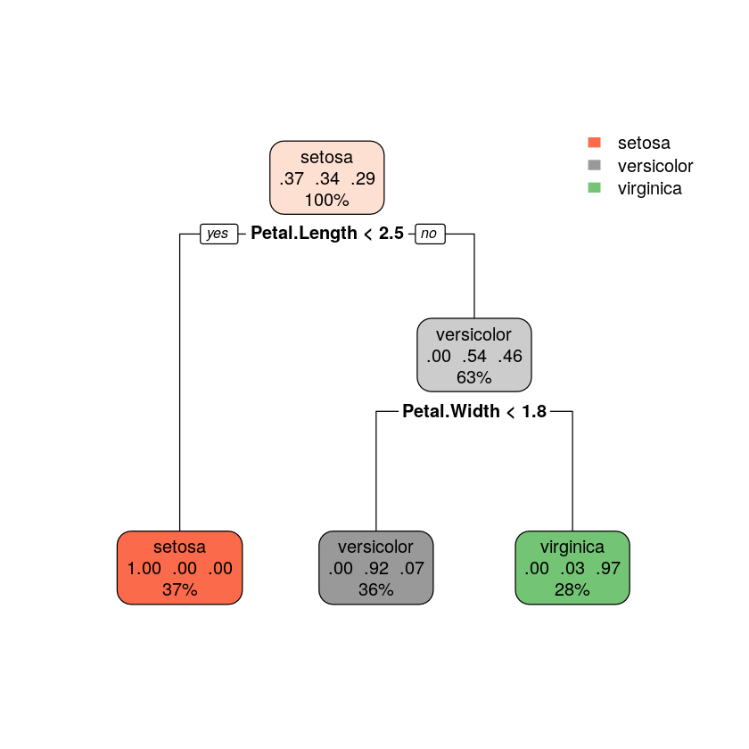

## Classification Decision Tree

Creates a model that predicts the value of the output variable based on the output.
Several decision trees are computed, the classification is done given the classification of all the different trees.

About Gini
http://stats.stackexchange.com/questions/92419/relative-importance-of-a-set-of-predictors-in-a-random-forests-classification-in


```R
> require(rpart)
> require(rpart.plot)

> idx<-sample(1:nrow(iris),round(nrow(iris)*0.75))
> train_data<-iris[idx,]
> test_data <-iris[-idx,]

> r_model<-rpart(Species~ . ,data=train_data)


```

```R
> r_model
n= 112 

node), split, n, loss, yval, (yprob)
      * denotes terminal node

1) root 112 71 setosa (0.36607143 0.33928571 0.29464286)  
  2) Petal.Length< 2.45 41  0 setosa (1.00000000 0.00000000 0.00000000) *
  3) Petal.Length>=2.45 71 33 versicolor (0.00000000 0.53521127 0.46478873)  
    6) Petal.Width< 1.75 40  3 versicolor (0.00000000 0.92500000 0.07500000) *
    7) Petal.Width>=1.75 31  1 virginica (0.00000000 0.03225806 0.96774194) *

> rpart.plot(r_model)

```

The root node has 112 elements in the following proportions setosa(37%), versicolor(34%) and virginica(29%). 
This node has two childs, depending on the petal lenght. If it is smaller than 2.45 then it is a setosa with 100% probability, there are 41 elements. If the petal length is bigger or equal to 2.45 then it is a versicolor(54%) or a virginica(46%). 



```R
> data.frame(predict(r_model,test_data),test_data)
> 
```


### Random Forest

http://www.listendata.com/2014/11/random-forest-with-r.html


## Logistic regression model

*Logistic regression model*, also known as *Logit Regression* or *Logit Model* is a *regression model* where the dependent variable is categorical, it can belong to two different classes.

In the *regression model* we try to minimize the sum quatratic error of \\( f_\Theta(x)\simeq \Theta^T x \\), given a vector \\( x \in \mathbb{R}^{n \times 1} \\) of known points where we have to find optimum values of \\( \Theta \in \mathbb{R}^{n \times 1} \\). Where \\(n\\) is the spacial dimension of our data.

In the *logistic regression model* we want to predict the value of our categorical variable which ideally should have only two values, 0 or 1 to indicate to which class it belongs. Thus we want to create a model that predicts \\( 0 \leq h_\Theta(x) \leq 1 \\). [Operating with probabilities](https://simple.wikipedia.org/wiki/Logistic_Regression) this gives to the result of the following formula:
\\[ h_\Theta(x)\simeq s(\Theta^T x) = \frac{1}{1+e^{-\Theta^T x}} \\]

Where \\(s(t) = \frac{1}{1+e^{-t}} \\) is the [sigmoid function](https://en.wikipedia.org/wiki/Sigmoid_function). We have the following classifier:
$$
 y = \left\{\begin{matrix} 
 h_\Theta(x) \geq  0.5& \Rightarrow  \Theta^T x \geq 0 & \text{Select class 1}\\ 
 h_\Theta(x) <  0.5 & \Rightarrow  \Theta^T x < 0 & \text{Select class 0} 
\end{matrix}\right.
$$

Recall that The cost function used for a *regression model* is:
$$
 J(\Theta)=\frac{1}{m}\sum^{m}_{i=1}{Cost(h_\Theta(x^{(i)}),y^{(i)})}
$$

Where \\(m\\) is the number of samples that we have collected. In the *linear regression model* the value of the cost function was defined as:
\\[ Cost(h_\Theta(x),y) = ( h_\Theta(x) - y )^2 \\]

This function in the *linear regression model* is [convex](http://mathworld.wolfram.com/ConvexFunction.html), but in the *logistic regression model* is not. So we cannot use gradient descent directly into this function. Thus we define a new cost function:
\\[ Cost(h_\Theta(x),y) = -y·log(h_\Theta(x))-(1-y)·log(1-h_\Theta(x)) \\]

To minimize this fuction we can apply gradient descent:
\\[
\Theta_j = \Theta_j - \alpha  = \Theta_j - \alpha \sum{(h_\Theta(x^{(i)})-y^{(i)})·x^{(i)}}
\\]


'''
library(ROCR)
p <- predict(model, newdata=subset(test,select=c(2,3,4,5,6,7,8)), type="response")
pr <- prediction(p, test$Survived)
prf <- performance(pr, measure = "tpr", x.measure = "fpr")
plot(prf)
'''


## C4.5

[C4.5](https://en.wikipedia.org/wiki/C4.5_algorithm) is an algorithm used to generate a decision tree.
