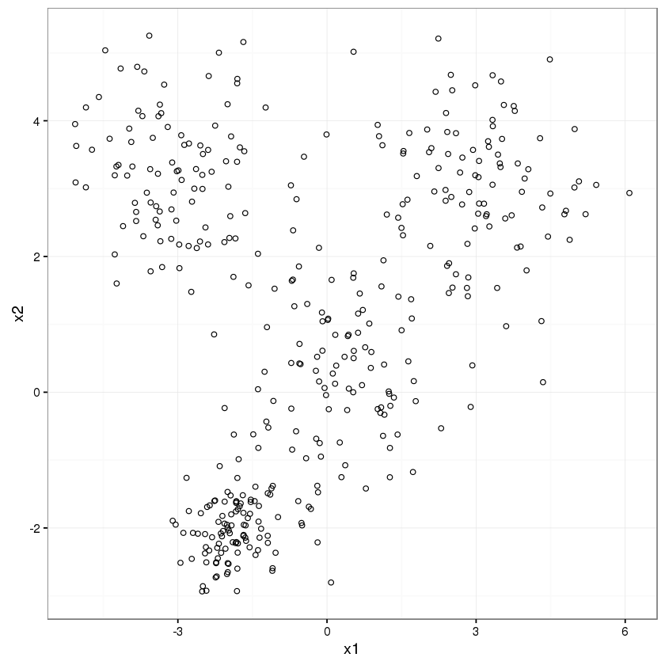
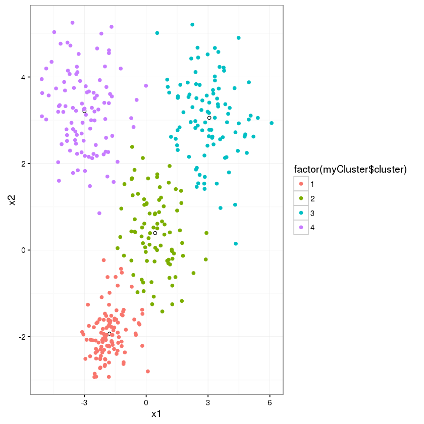

```R
library(ggplot2)
c0 = data.frame(x1=rnorm(100, mean=0, sd=1), x2=rnorm(100, mean=0, sd=1))
c1 = data.frame(x1=rnorm(100, mean=3, sd=1), x2=rnorm(100, mean=3, sd=1))
c2 = data.frame(x1=rnorm(100, mean=-3, sd=1), x2=rnorm(100, mean=3, sd=1))
c3 = data.frame(x1=rnorm(100, mean=-2, sd=0.5), x2=rnorm(100, mean=-2, sd=0.5))
data=rbind(c0,c1,c2,c3)

ggplot(data, aes(x=x1, y=x2)) + geom_point(shape=1) + theme_bw()
```





```R
set.seed(20)
myCluster <- kmeans(data, 4, nstart = 30)
myCluster$centers
```


<table>
<thead><tr><th></th><th scope=col>x1</th><th scope=col>x2</th></tr></thead>
<tbody>
	<tr><th scope=row>1</th><td>-1.779048</td><td>-1.931780</td></tr>
	<tr><th scope=row>2</th><td>0.4349488</td><td>0.3931574</td></tr>
	<tr><th scope=row>3</th><td>3.062444</td><td>3.057210</td></tr>
	<tr><th scope=row>4</th><td>-2.993991</td><td> 3.214143</td></tr>
</tbody>
</table>


```R
ggplot(as.data.frame(myCluster$centers), aes(x=x1, y=x2)) + geom_point(shape=1) + 
theme_bw() +
geom_point(data=data, aes(x=x1, y=x2, col=factor(myCluster$cluster)))
```




