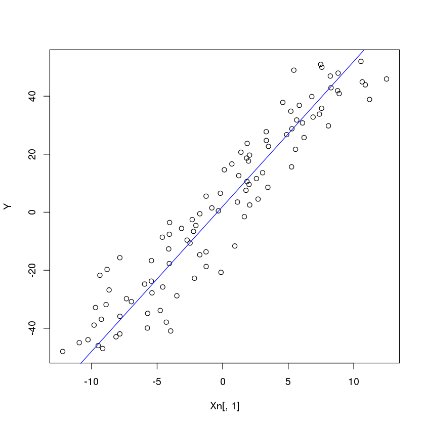
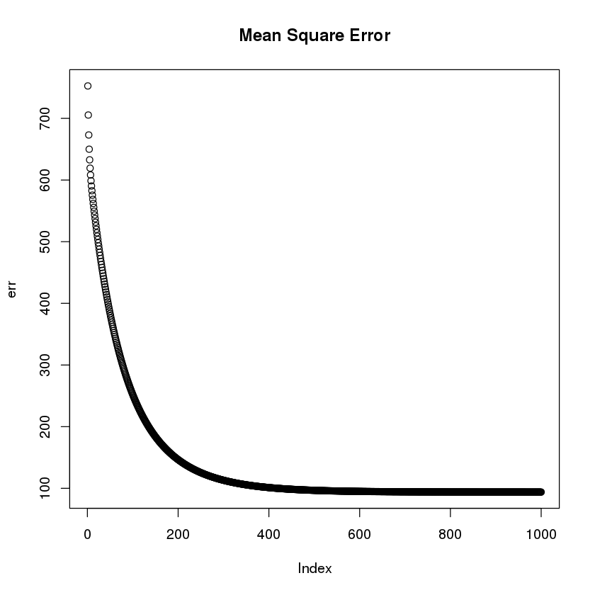
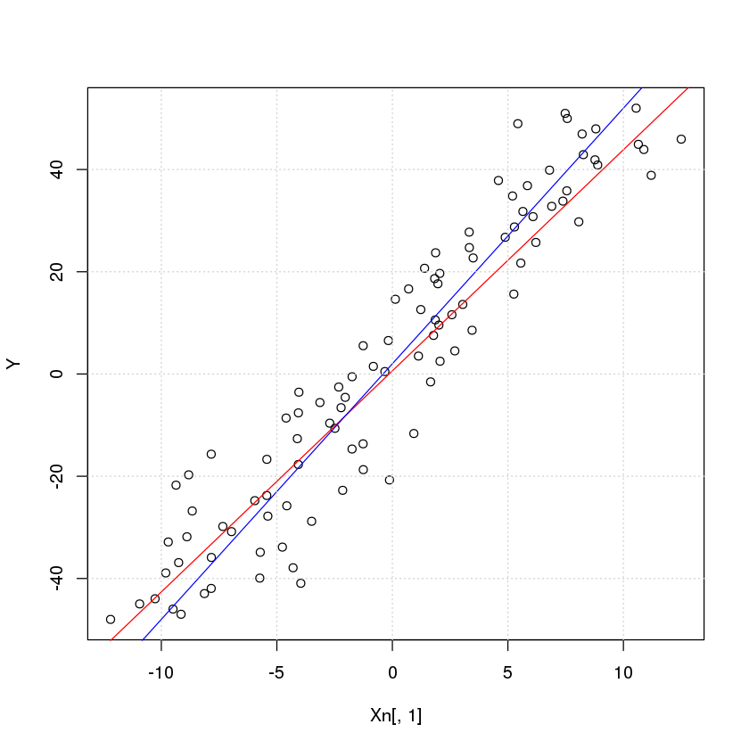
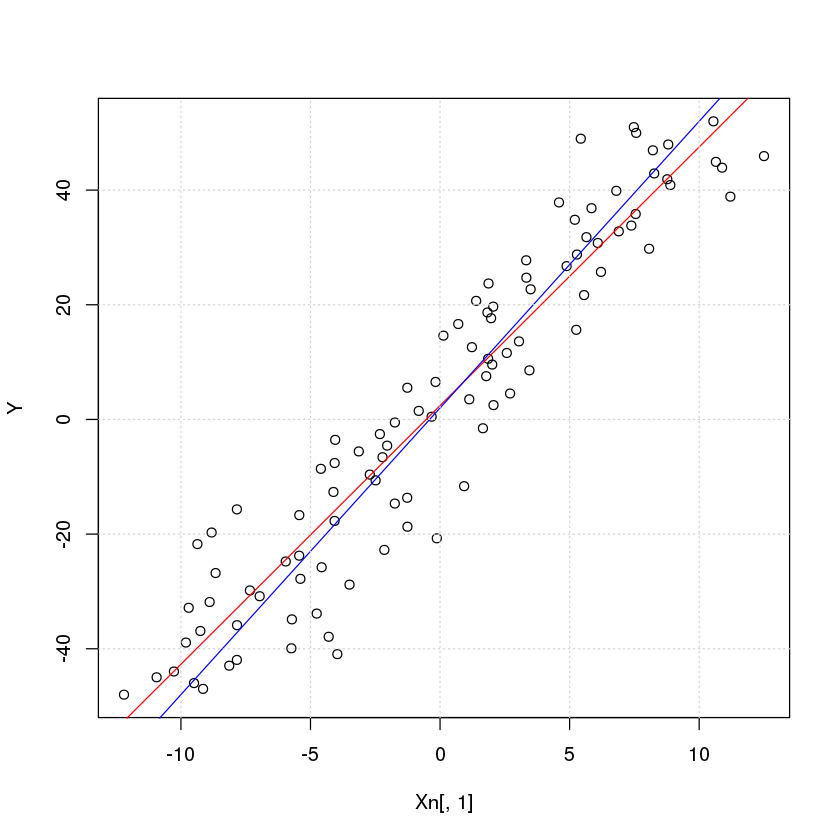

# Linear regression

[Linear regression](https://en.wikipedia.org/wiki/Linear_regression) is an approach for modeling the relationship beteween a *scalar* dependent variable (for no scalar see [general linear model](#GLM)). Given a dataset with $$n$$ statistical units:
\\[
\left \\{ y_i,x_{i1},x_{i2},\cdots,x_{ip} \right \\}_{i=1}^n
\\]
this model assumes that there is a linear relation between $$y_i$$ (the dependent variable) and the p-vector $$x_i$$ (the independent variables) plus an unobserved n-dimensional vector $$\varepsilon_i$$ which models the noise:

\\[
y_i = \beta_1·x_{i1}+\beta_2·x_{i2}+\cdots+\beta_p·x_{ip}+\varepsilon_i
\\]

This can be converted into a matrix form:

\\[
\mathbf{Y}=\mathbf{X}·\mathbf{\vec{\beta}}+\mathbf{\vec{\varepsilon}}
\\]

where $$\mathbf{Y}=\mathbb{R}^{n\times1}$$, $$\mathbf{X}=\mathbb{R}^{n\times p}$$, $$\vec{\beta}=\mathbb{R}^{p\times1}$$ and $$\vec{\varepsilon}=\mathbb{R}^{n\times1}$$:
\\[
\mathbf{Y}=\begin{bmatrix} y_1 \\\ y_2 \\\ \vdots \\\ y_n \end{bmatrix} 
\\]

\\[
\mathbf{X}=\begin{bmatrix} \vec{x_1}^T \\\ \vec{x_2}^T \\\ \vdots \\\ \vec{x_n}^T \end{bmatrix} =
\begin{bmatrix} x_{11} & x_{12} & \cdots & x_{1p} \\\ x_{21} & x_{22} & \cdots & x_{2p} \\\ \vdots & \vdots & \ddots & \vdots \\\ x_{n1} & x_{n2} & \cdots & x_{np}\end{bmatrix}
\\]


\\[
\vec{\beta}=\begin{bmatrix} \beta_1 \\\ \beta_2 \\\ \vdots \\\ \beta_p \end{bmatrix} \qquad
\vec{\varepsilon}=\begin{bmatrix} \varepsilon_1 \\\ \varepsilon_2 \\\ \vdots \\\ \varepsilon_n \end{bmatrix} 
\\]

The purpose of this regression is to find the optimum values for the p-vector $$vec{\beta}$$ that given the matrix of observations $$\mathbf{X}$$ produces the most accurate representation of $$\mathbf{Y}$$ under the following assumptions:
* **Weak exogeneity**: This essentially means that the predictor variables x can be treated as fixed values, rather than random variables.
* **Constant variance**: (a.k.a. homoscedasticity) This means that different response variables have the same variance in their errors, regardless of the values of the predictor variables. However, various estimation techniques (e.g. weighted least squares and heteroscedasticity-consistent standard errors) can handle heteroscedasticity in a quite general way. Bayesian linear regression techniques can also be used when the variance is assumed to be a function of the mean. It is also possible in some cases to fix the problem by applying a transformation to the response variable.
* **Independence of errors**: This assumes that the errors of the response variables are uncorrelated with each other

## Estimation methods


Also known as general linear model (not to be confused with the generalized linear model)

In a linear regression model we try to solve the following ecuation:


We define the basic input data with noise


```R
x <- seq(-10,10,length.out=100)
a <- 2
b <- 5
Y <- a+b*x
Xn <- x+cbind(rnorm(length(x),sd=2),rep(1,times=length(x)))

plot(Xn[,1],Y)
abline(c(a,b),col="blue")
```





We implement the Gradient descent method to calculate the parameters a and b


```R
Theta <- matrix(c(1,1),nrow=2)

#Cost function
J <- function(X,Theta, Y){
  j <- 1/length(X)*( sum(X %*% Theta - Y)^2)
}

#Derivate of the cost function
dJ <- function(X,Theta, Y){
  dj <- 1/length(X)*t(X)%*%( X %*% Theta - Y)
}

maxIter <- 1000
alpha <- 0.01
err<-rep(0,maxIter)
for (i in 1:maxIter){
    Theta <- Theta - alpha*dJ(Xn,Theta,Y)
    err[i] <- J(Xn,Theta,Y)
}

an <- Theta[1]
bn <- Theta[2]

print(paste("Estimated value of a=",an,", b=",bn))
```

    [1] "Estimated value of a= 0.614237488865548 , b= 4.32518417215818"


```R
plot(err, main="Mean Square Error")
```





The approximation to our curve in red with the original curve in red:


```R
plot(Xn[,1], Y)
abline(Theta,col='red')
abline(c(a,b),col='blue')
grid()
```





```R
Another way to do this is using the Moore–Penrose pseudoinverse matrix
```


```R
Theta<-solve(t(Xn) %*% Xn)%*%t(Xn)%*%Y
print(paste("Estimated value of a=",Theta[1],", b=",Theta[2]))
```

    [1] "Estimated value of a= 0.614233014830346 , b= 4.32518880315233"


This pseudoinverse is included in the MASS R library as ginv(A)


```R
library(MASS)
Theta<-ginv(Xn)%*%Y
print(paste("Estimated value of a=",Theta[1],", b=",Theta[2]))
```

    [1] "Estimated value of a= 0.614233014830342 , b= 4.32518880315233"


But R also incorporates a function to calculate linear regression. This is the one which produces the better output


```R
fit <- lm(Y ~ Xn[,1])
print(paste("Estimated value of a=",fit$coefficients[1],", b=",fit$coefficients[2]))

plot(Xn[,1], Y)
abline(fit,col='red')
abline(c(a,b),col='blue')
grid()
```

    [1] "Estimated value of a= 2.40283864349388 , b= 4.51088771771247"





# Ridge penalty

## <a name="GLM"></a>General linear model

The [general linear model](https://en.wikipedia.org/wiki/General_linear_model) assumes that $$Y$$ is a multivariate, it is not a single scalar. This methods are sometimes called [multivariate linear models](http://www.public.iastate.edu/~maitra/stat501/lectures/MultivariateRegression.pdf).


## <a name="GZLM"></a>Generalized linear model

https://en.wikipedia.org/wiki/Generalized_linear_model

# Stepwise regression

In statistics, stepwise regression is a method of fitting regression models in which the choice of predictive variables is carried out by an automatic procedure.[1][2][3][4] In each step, a variable is considered for addition to or subtraction from the set of explanatory variables based on some prespecified criterion. Usually, this takes the form of a sequence of F-tests or t-tests, but other techniques are possible, such as adjusted R2, Akaike information criterion, Bayesian information criterion, Mallows's Cp, PRESS, or false discovery rate.
https://en.wikipedia.org/wiki/Stepwise_regression


# Generalized additive model

In statistics, a generalized additive model (GAM) is a generalized linear model in which the linear predictor depends linearly on unknown smooth functions of some predictor variables, and interest focuses on inference about these smooth functions. GAMs were originally developed by Trevor Hastie and Robert Tibshirani[1] to blend properties of generalized linear models with additive models.

https://en.wikipedia.org/wiki/Generalized_additive_model
Routines for generalized additive modelling under shape
constraints on the component functions of the linear predictor
(Pya and Wood, 2015) <doi:10.1007/s11222-013-9448-7>.
Models can contain multiple shape constrained (univariate
and/or bivariate) and unconstrained terms. The routines of gam()
in package 'mgcv' are used for setting up the model matrix,
printing and plotting the results.  Penalized likelihood
maximization based on Newton-Raphson method is used to fit a
model with multiple smoothing parameter selection by GCV or

https://cran.r-project.org/web/packages/scam/scam.pdf

