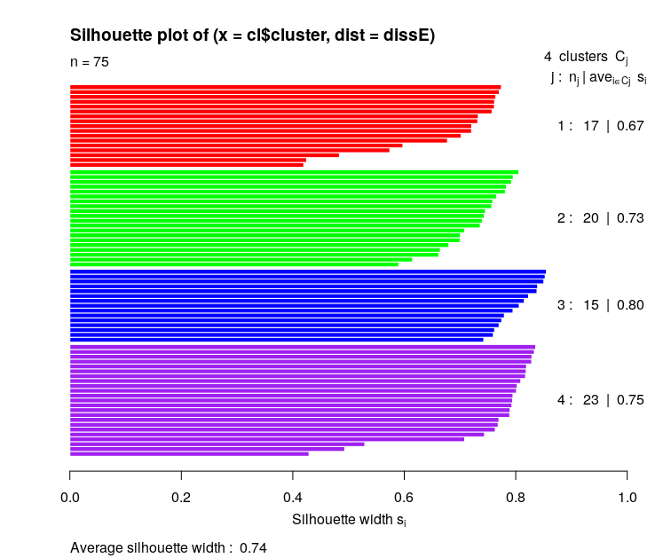
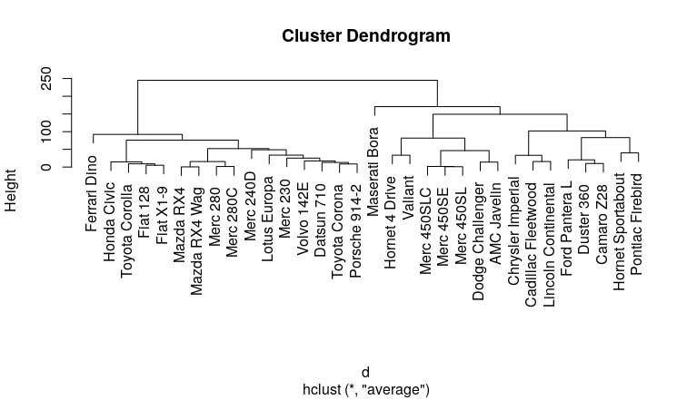

Clustering is an unsupervised learning strategy where the goal is to group elements which share similar characteristics. There are different algorithms to deal with this problem and there is no one which is better that others, it depends on the data to be clustered. 


# Distance measured

Many clustering algorithms use the concept of distance between data samples. This distance is a measure of how related those samples are to each other.


* [Minkowski distance](https://en.wikipedia.org/wiki/Minkowski_distance): $$\left \|  a-b \right \|_p = \left ( \sum_i \mid a_i-b_i \mid^p \right )^\frac{1}{p}$$
* [Manhattan distance](https://en.wikipedia.org/wiki/Taxicab_geometry): $$\left \|  a-b \right \| =  \sum_i \left \| a_i-b_i \right \| $$
* [Euclidean distance](https://en.wikipedia.org/wiki/Euclidean_distance): $$\left \|  a-b \right \|_2 = \sqrt{\sum_i \left ( a_i-b_i \right )^2}$$
* [Maximum distance](https://en.wikipedia.org/wiki/Uniform_norm): $$\left \|  a-b \right \|_\infty = max_i \mid  a_i-b_i \mid$$
* [Mahalanobis distance](https://en.wikipedia.org/wiki/Mahalanobis_distance): $$\sqrt{\left ( a-b \right )^\intercal \sigma_{a,b}^{-2}  \left ( a-b \right )}$$
* [Correlation distance](https://en.wikipedia.org/wiki/Distance_correlation): $$\rho_{a,b} = \frac{\sigma_{a,b}^2}{\sigma_a\sigma_b}$$
* [Hamming distance](https://en.wikipedia.org/wiki/Hamming_distance):  The Hamming distance between two strings of equal length is the number of positions at which the corresponding symbols are different.
* [Levenshtein distance](https://en.wikipedia.org/wiki/Levenshtein_distance): The Levenshtein distance between two words is the minimum number of single-character edits (insertions, deletions or substitutions) required to change one word into the other.
* [Gower similarity coefficient](http://www.clustan.talktalk.net/gower_similarity.html): It is a composite measure. It takes samples in which each dimension can be binary, factor variable, quantitative (ordinal) or numeric. The coefficient ranges between 0 and 1. More info [here](http://www.math.vu.nl/~sbhulai/papers/thesis-vandenhoven.pdf).


# Cluster quality indexes

When comparing different clustering algorithms it is helpful to have a measure which one is better. In this section we propose different indexes which help to rate clusters.


## Homogeneity

Homogeneity measures intra-group distance, this means, how close are the elements inside a cluster. It follows the next formula:
\\[
H(C)=\frac{1}{\mid C \mid} \sum_{x_i,x_j \in C} d(x_i,x_j)
\\]
Where $$C$$ is the cluster for which homogeneity is calculated and $$\mid C \mid$$ is the number of elements for that cluster. The function $$d(x_i,x_j)$$ gives the distance between the element $$x_i$$ and $$x_j$$. See [Distance measured](# Distance measured) for more info.

## Separation

Separation measures the inter-group distance, this means, how separated the clusters are:
\\[
S(C,C_k)=\frac{\sum_{x_i \in C, x_j \in C_k} d(x_i,x_j)}{\mid C \mid · \mid C_k \mid} \\\
S(C)=\frac{1}{\mathcal{C}} \sum_{C_k \in \mathcal{C}} S(C,C_k)
\\]
Where $$\mathcal{C}$$ is the group of all the clusters $$\mid \mathcal{C} \mid$$ is the number of clusters.


## Average silhouette width (ASW)

The silhouette value is a measure of how similar an object is to its own cluster (cohesion) compared to other clusters (separation). The silhouette ranges from -1 to 1, where a **high value indicates that the object is well matched** to its own cluster and poorly matched to neighboring clusters. If most objects have a high value, then the clustering configuration is appropriate. If many points have a low or negative value, then the clustering configuration may have too many or too few clusters.

\\[
s(i)=\frac{b(i)-a(i)}{max \left \( a(i), b(i) \right \)}
\\]
where a(i) is the average dissimilarity between i and all other points of the cluster to which i belongs.
\\[
a(i)=\frac{1}{\mid C(i) \mid -1 } \sum_{x \in C(i)} d(x_i,x)
\\]
and b(i) be the lowest average dissimilarity of *i* to any other cluster, of which *i* is not a member. The cluster with this lowest average dissimilarity is said to be the *neighbouring cluster* of *i* because it is the next best fit cluster for point *i*:
\\[
b(i)=min_{j \notin C(i)} \frac{1}{\mid C(j) \mid } \sum_{x \in C(i)} d(x_i,x)
\\]
$$C(i)$$ is the cluster to which $$i$$ belongs, and $$\mid C(i) \mid$$ is the number of elements in that cluster.


```R
> require(cluster)
> cl<-kmeans(ruspini,4)
> dissE <- daisy(ruspini)
> sil<-silhouette(cl$cluster,dissE)
> summary(sil)
Silhouette of 75 units in 4 clusters from silhouette.default(x = cl$cluster, dist = dissE) :
 Cluster sizes and average silhouette widths:
       17        20        15        23 
0.6691154 0.7262347 0.8042285 0.7548344 
Individual silhouette widths:
   Min. 1st Qu.  Median    Mean 3rd Qu.    Max. 
 0.4196  0.7145  0.7642  0.7377  0.7984  0.8549 
> plot(sil,col = c("red", "green", "blue", "purple"))
```



## Davies–Bouldin index 

The [Davies–Bouldin](https://en.wikipedia.org/wiki/Davies%E2%80%93Bouldin_index) index can be calculated by the following formula:
\\[
DB={\frac {1}{\mid \mathcal{C} \mid}}\sum_{i=1}^{n}\max_{j\neq i}\left({\frac{\overline{d_i}+\overline{d_j}}{d(c_{i},c_{j})}}\right)
\\]
where n is the number of clusters, $$c_{x}$$ is the centroid of cluster $$x$$, $$\overline{d_x}$$ is the average distance of all elements in cluster $$x$$ to centroid $$c_{x}$$, and $$d(c_{i},c_{j})$$ is the distance between centroids $$c_{i}$$ and $$c_{j}$$. Since algorithms that produce clusters with low intra-cluster distances (high intra-cluster similarity) and high inter-cluster distances (low inter-cluster similarity) will have a low Davies–Bouldin index, **the clustering algorithm that produces a collection of clusters with the smallest Davies–Bouldin index is considered the best algorithm** based on this criterion.


## Other clustering indexes

More clustering indexes like:

* More cluester
* Calinski-Harabasz
* Baker-Hubert
* Hubert-Levine
* Krzanowski-Lai
* Hartigan index
* Gap
* Davies-Bouldin

and many more can be found [here](https://cran.r-project.org/web/packages/clusterCrit/vignettes/clusterCrit.pdf) and [here](https://cran.r-project.org/web/packages/clusterSim/clusterSim.pdf).


# Clustering algorithms

The different clustering algorithms can be grouped based on the approach used to group the data:


## Hierarchical clustering

Also known as [connectivity based clustering](https://en.wikipedia.org/wiki/Hierarchical_clustering), is based on the core idea of objects being more related to nearby objects than to objects farther away. These algorithms connect "objects" to form "clusters" based on their distance. There are two approaches to tackle this clustering problem:
* **Agglomerative** (bottom-up): Each element begins into its own cluster. Iteratively the most similar clusters are merged up to finish with one big cluster containing all the elements.
* **Divisive** (top-down): All the elements belong to the same cluster. This cluster is iteratively split until all clusters have just one element.

The merging or division of clusters is made based on different methods to measure these clusters similarities:
* *single-linkage* (SLCA): The distance between two clusters is the **minimum** distance that exists between two elements that belong to different clusters.
* *complete-linkage* (CLCA): The distance between two clusters is the **maximum** distance that exists between two elements that belong to different clusters.
* *average-linkage* ([UPGMA](https://en.wikipedia.org/wiki/UPGMA)): The distance between two clusters is the **average** distance that exists from any element in the first cluster to any element in the other cluster.
* *cendroid-linkage* (UPGMC): The distance between two clusters is the distance that exists between the **centroinds** of each cluster.
* *McQuitty* Weighted arithmetic average clustering([WPGMA](https://en.wikipedia.org/wiki/WPGMA)): At each step, the nearest two clusters, say $$i$$ and $$j$$, are combined into a higher-level cluster $$i\cup j$$. Then, its distance to another cluster $$k$$ is simply the arithmetic mean of the distances between $$k$$ and members of $$i\cup j$$.
* *median-linkage*, Weighted centroid clustering (WPGMC): This is similar to UPGMC but each cluster has the same weight independently of the number of elements.
* *[Ward's method](https://en.wikipedia.org/wiki/Ward%27s_method)*: the distance between two clusters is the sum of squared deviations from points to centroids.

Single-link clustering has a drawback known as the *chaining effect*: A few points that form a bridge between two clusters cause the single-link clustering to
unify these two clusters into one.
The weighted methods WPGMA and WPGMC can be used in cases where groups of objects representing different groups are represented by unequal numbers of elements.
UPGMC and WPGMC do not produce a monotone distance measure, which can cause the called *reversals* in the dendrogram.  

In R this can be calculated with the function *hclust*:

```R
> d <- dist(as.matrix(mtcars))
> hc <- hclust(d,method="average")
> plot(hc)
```



## Partitioning methods

Partitioning methods relocate instances by moving them from one cluster to another, starting from an initial partitioning. Such methods typically require that the number of clusters will be pre-set by the user.
The basic idea is to find a clustering structure that minimizes a certain error criterion which measures the “distance” of each instance to its representative value.

#### K-means

[K-means](https://en.wikipedia.org/wiki/K-means_clustering) is the most popular and basic clustering algorithm. It is based centroids which are iteratively calculated in order to minimize the distance between the centroid and the elements which belong to that centroid.


#### K-medoids

[K-medoids](https://en.wikipedia.org/wiki/K-medoids) is closely related to k-means but instead of centroids it uses [metoids](https://en.wikipedia.org/wiki/Medoid). The most common realisation of k-medoid clustering is the Partitioning Around Medoids (PAM) algorithm.


## Density based methods

In density-based clustering, clusters are defined as areas of higher density than the remainder of the data set. Objects in these sparse areas - that are required to separate clusters - are usually considered to be noise and border points.

#### DBSCAN

Density-based spatial clustering of applications with noise ([DBSCAN](https://en.wikipedia.org/wiki/DBSCAN)).
 It is a density-based clustering algorithm: given a set of points in some space, it groups together points that are closely packed together (points with many nearby neighbors), marking as outliers points that lie alone in low-density regions (whose nearest neighbors are too far away).

#### OPTICS

Its basic idea is similar to DBSCAN, but it addresses one of DBSCAN's major weaknesses: the problem of detecting meaningful clusters in data of varying density. In order to do so, the points of the database are (linearly) ordered such that points which are spatially closest become neighbors in the ordering. Additionally, a special distance is stored for each point that represents the density that needs to be accepted for a cluster in order to have both points belong to the same cluster.


## Model-based clustering methods

The clustering model most closely related to statistics is based on distribution models. Clusters can then easily be defined as objects belonging most likely to the same distribution. A convenient property of this approach is that this closely resembles the way artificial data sets are generated: by sampling random objects from a distribution.

## Grid-based methods


## Soft-computing methods


