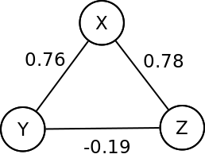
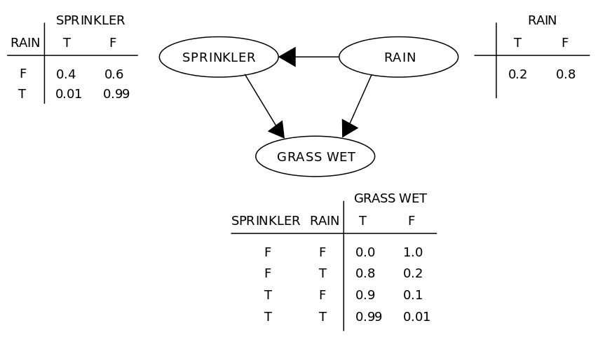
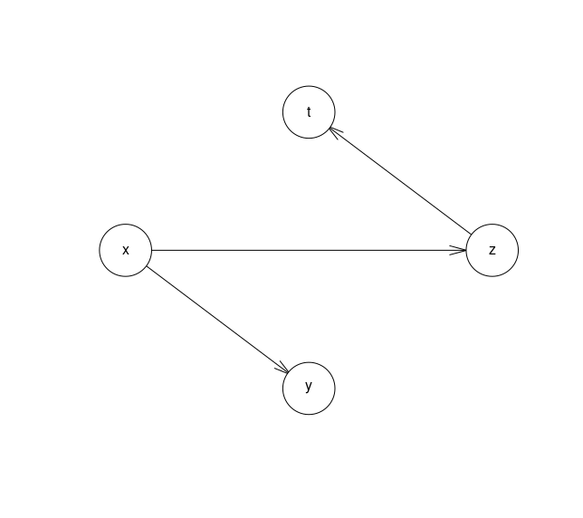

1. 
{:toc}

# Network Inference 

The purpose of this section is to explain how to obtain a network of related elements from different data. We can have for example gene expression data where each row represents the gene expression level per each condition. Or we can have a computer network and see if from the correlation we can infer the network structure.

## Basic network inference

We can calculate the correlation and obtain the relations of different elements. The most popular is the [Pearson correlation](https://en.wikipedia.org/wiki/Pearson_correlation). It can be derived from the covariance matrix:
\\[\rho_{X,Y} = \frac{\sigma_{X,Y}^2}{\sigma_X\sigma_Y} \\]

If we have an ordinal associaton, this means that instead of having the real numbers we have a sortered ranking with labels for the "first", "second", "third", etc... then we must use a [rank correlation](https://en.wikipedia.org/wiki/Rank_correlation). From all the available correlation coefficients, we emphasize:
* The [Spearman correlation coefficient](https://en.wikipedia.org/wiki/Spearman%27s_rank_correlation_coefficient) which is defined as the Pearson correlation coefficient between the ranked variables. The Spearman correlation between two variables is equal to the Pearson correlation between the rank values of those two variables; while Pearson's correlation assesses linear relationships, Spearman's correlation assesses monotonic relationships (whether linear or not).
* The Kendall rank correlation coefficient, commonly referred to as [Kendall's tau coefficient](https://en.wikipedia.org/wiki/Kendall_rank_correlation_coefficient), is a statistic used to measure the ordinal association between two measured quantities.

A good summary about network inference can be found [here](http://www.nathalievilla.org/doc/pdf/wikistat-network_compiled.pdf).

## Relevance network

Correlation can be misleading, let's imagine that we have two functions:
\\[y=2·x+1+\varepsilon_0\\]
\\[z=2·x+1+\varepsilon_1\\]
where $$\varepsilon_0$$ and $$\varepsilon_1$$ are additive white random noise. This means that the variable x is highly correlated with y and z. But there is also a high correlation between z and y. Obviously we are interested in knowing if the relation between y and z is a true relation or if they are correlated with a third variable (the variable x in this case).

```R
> set.seed(2807)
> x <- rnorm(100)
> y <- 2*x+1+rnorm(100,0,0.1)

> cor(x,y)
# [1] 0.9988261
> z <- 2*x+1+rnorm(100,0,0.1)
> cor(x,z)
# [1] 0.998751
> cor(y,z)
# [1] 0.9971105
```
Try to find these relations is very common in bioinformatics where relations between different genes are found looking at the evolution of the gene expression level and how they are related. This underlying network between different genes is what has been known as [Relevance network](https://www.ncbi.nlm.nih.gov/pmc/articles/PMC2232846/pdf/procamiasymp00004-0748.pdf).

### Gaussian Graphical Model

The [partial correlation](https://en.wikipedia.org/wiki/Partial_correlation) measures the degree of association between two random variables. It is the correlation that remains between two variables if the effect of the other variables have been regressed away.


Formally, the partial correlation between $$y$$ and $$z$$ given a set of n controlling variables X = {X1, X2, ..., Xn}, written $$\rho_{zy·x}$$, is the correlation between the residuals $$R_z$$ and $$R_y$$ resulting from the linear regression of Z with X and of Y with X, respectively. In the [linear regression](/ml/linear_regression/) problem we are trying to obtain the optimum value of $$\beta$$ that minimizes the minimum quadratic error.
\\[y=\alpha+\beta·x+\epsilon\\]
This gives a $$\beta$$ of:
\\[\beta=\frac{\sum_{i=1}^n(y_i-\bar{y})(x_i-\bar{x})}{\sum_{i=1}^n(x_i-\bar{x})^2}=\frac{Cov(x,y)}{Var(x)}=X^t·X^{-1}·X^t·y\\]

The first-order partial correlation (i.e. when n=1) is the difference between a correlation and the product of the removable correlations divided by the product of the coefficients of alienation of the removable correlations. 

Gaussian Graphical Models assume that the edges between nodes follow a gaussian distribution. $$x\sim \mathcal{N}\left ( \mu , \Sigma  \right )$$ where $$\Sigma$$ is the covariance matrix and $$\mu$$ the median vector. From the previous example we can estimate the covariance and mean:
```R
> cov(cbind(x,y,z))
          x        y        z
x 0.9622105 1.947012 1.922462
y 1.9470117 3.949001 3.888234
z 1.9224621 3.888234 3.850623
> colMeans(cbind(x,y,z))
         x          y          z 
0.01702236 1.05022003 1.03544251 
```

To find the underlying relation between the variables we have to remove the undesired effects of the other variables. For example to calculate $$\rho_{zy·x}$$, as we said before we have to calculate the correlation between the residuals respect $$x$$. This can be easily done in R:
```R
> Ry_x<-lm(y~x)$residuals
> Rz_x<-lm(z~x)$residuals
> cor(Ry_x,Rz_x)
[1] -0.1933699
```

Which means that between $$y$$ and $$z$$ there is no relation, the partial correlation is low. But there is a high partial correlation between $$y$$-$$x$$ and $$z$$-$$x$$ as expected:
```R
> Ry_z<-lm(y~z)$residuals
> Rx_z<-lm(x~z)$residuals
> cor(Ry_z,Rx_z)
[1] 0.7801174
> Rx_y<-lm(x~y)$residuals
> Rz_y<-lm(z~y)$residuals
> cor(Rx_y,Rz_y)
[1] 0.7639094
```

The analytical [formula](https://en.wikipedia.org/wiki/Partial_correlation#Using_recursive_formula) to calculate the partial correlation between two variables removing the influence of a third one is:
\\[
\rho_{xy·z}=\frac{\rho_{xy}-\rho_{xz}\rho_{yz}}{\sqrt{(1-\rho_{xz}^2)(1-\rho_{yz}^2)}}
\\]


This can also be generalized to remove the influence of all the other variables from the set **V**, except the two under study, from the covariance matrix $$\Sigma$$ as explained [here](https://en.wikipedia.org/wiki/Partial_correlation#Using_matrix_inversion). Its inverse, $$S=\Sigma^{-1}$$, is called the [precision matrix](https://en.wikipedia.org/wiki/Precision_(statistics)) and is related to the partial correlation by:
\\[
\rho_{ij·V \setminus \\{i,j\\} }=-\frac{S_{ij}}{\sqrt{S_{ii}S_{jj}}}
\\]

We can check in R that this produces the same results as we had before:
```R
> S<-solve(cor(cbind(x,y,z)))
> S
          x          y          z
x 1023.3645 -525.10123 -498.50230
y -525.1012  442.72677   82.99785
z -498.5023   82.99785  416.12163
> -S[2,3]/sqrt(S[2,2]*S[3,3])
[1] -0.1933699
> -S[1,2]/sqrt(S[1,1]*S[2,2])
[1] 0.7801174
> -S[1,3]/sqrt(S[1,1]*S[3,3])
[1] 0.7639094
```
These partial correlations can be translated into the following graph:



The R package [GenNet](https://cran.r-project.org/web/packages/GeneNet/) provides the partial correlation function using a similar methodology.

This method can be improved like any other least square estimator using the L1 norm [Lasso](https://en.wikipedia.org/wiki/Lasso_(statistics)) or the L2 norm [Ridge](https://en.wikipedia.org/wiki/Tikhonov_regularization) regularizations.
The R package [glasso](https://cran.r-project.org/web/packages/glasso/) estimates a sparse inverse covariance matrix using lasso regularization.

Although often very effective, the main limitations of these methods is of course the Gaussianity assumption, which also implies linear dependencies between variables, and the undirected nature of the  inferred links between nodes.

More information about Gaussian Graphical Models can be found [here](http://ir.hit.edu.cn/~jguo/docs/notes/report-in-princeton-research.pdf).


### Dependency network


The [dependency network](https://en.wikipedia.org/wiki/Dependency_network) approach provides a system level analysis of the activity and topology of directed networks. The approach extracts causal topological relations between the network's nodes (when the network structure is analyzed), and provides an important step towards inference of causal activity relations between the network nodes (when analyzing the network activity).

The problem with the partial correlation is that many different causal relationships can correlate the same pair of variables. A small value of $$\rho_{xy·z}$$ may indicate two different possibilities: 
1. That variable *Z* is strongly affecting the corrrelation between *X* and *Y*.
1. That correlation coefficients $$\rho_{xy}$$, $$\rho_{xz}$$ and $$\rho_{yz}$$ are small.

To focus only in the first possibility the dependency of *X* and *Y* on *Z* is given by:
\\[
d_{xy·z}=\rho_{xy}-\rho_{xy·z}
\\]
This quantity is large only when a significant fraction of the correlation $$\rho_{xy}$$ comes from their dependency to *Z*. Given the elements *X*,*Y* and *Z*:
\\[
d_{xy·z} \geq \left \langle d_{xy·z} \right \rangle_Z + k·\sigma_z(d_{xy·z})  
\\]
Where: $$\left \langle d_{xy·z} \right \rangle_Z$$ is the mean over Z and $$\sigma_z(d_{xy·z})$$ is the standard deviation.
It is possible to construct a weighted network in which the weight associated with the direction lit $$Z \rightarrow  X$$ is given by the total number of variables *Y* that satisfy the previous equation.

A more detailed description can be found in: *Dror Y. Kenett et. al (2010), [Dominating clasp of the financial sector revealed by partial correlation analysis of the stock market](http://journals.plos.org/plosone/article?id=10.1371/journal.pone.0015032)*

## Bayesian networks

A [Bayesian network](https://en.wikipedia.org/wiki/Bayesian_network) is a [probabilistic graphical model](https://en.wikipedia.org/wiki/Graphical_model) that represents a set of random variables and their conditional dependencies via a directed acyclic graph. 
Edges represent conditional dependencies; nodes that are not connected (there is no path from one of the variables to the other in the Bayesian network) represent variables that are conditionally independent of each other. Each node is associated with a probability function that takes, as input, a particular set of values for the node's parent variables, and gives (as output) the probability (or probability distribution, if applicable) of the variable represented by the node.

One  limitation  of  Bayesian networks for network inference is that these models do not allow the presence of cycles (feedback loops). While this limitation is partially circumvented by [dynamic Bayesian networks](https://en.wikipedia.org/wiki/Dynamic_Bayesian_network), these models can  only  be  learned  from  time-series  expression  data.

A detailed description about Bayesian networks and different learning algorithms can be found [here.](http://www.cs.technion.ac.il/~dang/books/Learning%20Bayesian%20Networks(Neapolitan,%20Richard).pdf)

#### Example
The following example is extracted from the [wikipedia](https://en.wikipedia.org/wiki/Bayesian_network#Example):

Suppose that there are two events which could cause grass to be wet: either the sprinkler is on or it's raining. Also, suppose that the rain has a direct effect on the use of the sprinkler (namely that when it rains, the sprinkler is usually not turned on). Then the situation can be modeled with a Bayesian network (shown to the right). All three variables have two possible values, T (for true) and F (for false).


The joint probability function is:
\\[
    Pr(G,S,R)=Pr(G|S,T)·Pr(S|R)·Pr(R)
\\]

where the names of the variables have been abbreviated to *G=Grass wet (yes/no)*, *S=Sprinkler turned on (yes/no)*, and *R=Raining (yes/no)*. The model can answer questions like "What is the probability that it is raining, given the grass is wet?" by using the conditional probability formula and summing over all nuisance variables:
\\[
    Pr(R=T|G=T)=\frac{Pr(G=T,R=T)}{Pr(G=T)}=\frac{\sum_{S \in \\{T,F \\}} Pr(G=T,S,R=T) }{ \sum_{S,R\in \\{T,F\\}} Pr(G=T,S,R)}
\\]

Using the expansion for the joint probability function Pr(G,S,R) and the conditional probabilities from the conditional probability tables stated in the diagram, one can evaluate each term in the sums in the numerator and denominator. Then the numerical results are:
\\[
   Pr(R=T|G=T)=\frac{0.00198+0.1584}{0.00198+0.288+0.1584+0.0}=\frac{891}{2491} \approx 0.357
\\]


#### R example

In R the package [bnlearn](http://www.bnlearn.com/) provides different tools to work with Bayesian networks.
We can come back to the previous example were we have different linear variables:

```R
> set.seed(2807)
> x <- rnorm(100)
> y <- 2*x+1+rnorm(100,0,0.1)
> z <- 2*x+1+rnorm(100,0,0.1)
> t <- z-1+rnorm(100,0,0.1)
> dfvars<-data.frame(x,y,z,t)
```

We can learn the Bayesian network using the *hill-climb* algorithm, which shows the relation between *x*, *y*, *z* and *t* with a high degree of accuracy:
```R
> bnet<-hc(dfvars)
> plot(bnet)
```

```R
> bn.fit(bnet, data = dfvars)

  Bayesian network parameters

  Parameters of node x (Gaussian distribution)

Conditional density: x
Coefficients:
(Intercept)  
 0.07971619  
Standard deviation of the residuals: 1.042137 

  Parameters of node y (Gaussian distribution)

Conditional density: y | x
Coefficients:
(Intercept)            x  
  0.9911405    1.9987401  
Standard deviation of the residuals: 0.09856368 

  Parameters of node z (Gaussian distribution)

Conditional density: z | x
Coefficients:
(Intercept)            x  
  0.9996305    2.0032088  
Standard deviation of the residuals: 0.1132584 

  Parameters of node t (Gaussian distribution)

Conditional density: t | z
Coefficients:
(Intercept)            z  
  -1.017244     1.000161  
Standard deviation of the residuals: 0.09202482 
```


## Mutual information networks

The problem with correlation  coefficients is that they  fail  to  capture  more  complex statistical  dependencies  (e.g.  non-linear  ones) between variables, and thus more general measures of dependency based on mutual information (MI), have been proposed. The distance used to measure how close two nodes are is the [mutual information](https://en.wikipedia.org/wiki/Mutual_information):
\\[
 I(X;Y)=\sum_{y\in Y}\sum_{x\in X}p(x,y)\log {\left({\frac {p(x,y)}{p(x)\,p(y)}}\right)}
\\]
Mutual information measures the information that X and Y share:
* If both variables are independent then $$p(x,y)=p(x)\,p(y)$$ and the mutual information is 0.
* If X is a deterministic function of Y, then all information from one is included in the other, thus the mutual information is equal to the entropy.


Several algorithms based on mutual information networks are implemented in the [minet](https://bmcbioinformatics.biomedcentral.com/articles/10.1186/1471-2105-9-461) Bioconductor package:
* Relevance network
* CLR Algorithm 
* ARACNE: Algorithm for the Reconstruction of Accurate Cellular Networks
* MRNET: Maximum  rele-vance/minimum  redundancy

More information can be found in [Minet : A R/Bioconductor package for inferring large transcriptional networks using mutual information. BMC Bioinformatics](https://bmcbioinformatics.biomedcentral.com/articles/10.1186/1471-2105-9-461).


## Random Forest

This algorithm does not perform any assumption over the network distribution. Assuming that the network to infer has *p* known nodes the learning sample used to infer the network will be:
\\[
LS=\\{\vec{x}_1,\vec{x}_2,...,\vec{x}_N\\}
\\]

where $$\vec{x}_k \in \mathbb{R}^p\, , \, k=1,...,N$$ is a vector of values of all *p* nodes in the *kth* iteration:
\\[
\vec{x_k}=(x_k^1,x_k^2,...,x_k^p)^T
\\]
The idea is to try to predict the value of the node *j* in all the *k* iterations using as input the remaining *p-1* nodes. The input will be:
\\[
\overrightarrow{x_k}^{-j}=(x_k^1,...,x_k^{j-1},x_k^{j+1},...,x_k^p)^T
\\]
and the algorithm will try to minimize the quadratic error:
\\[
\sum_{k=1}^N \left ( x_k^j-\textit{f}_j (\vec{x}_k^{-j}) \right )^2
\\]
where $$\textit{f}_j(\vec{x}_k^{-j})$$ is the function that approximates the values of the node *j*. 
This function is estimated with the [random forest](https://en.wikipedia.org/wiki/Random_forest) algorithm. This algorithm is able to give a weight of how much a node contributes to the final result, which means how much one node influences into the response. This weight is used as the arch weight between two nodes.

Before running the algorithm a normalization must be done into the input matrix because the weights given by random forest introduce a positive  bias  for the links towards the more highly variable nodes. 

More information can be found in "[Inferring regulatory networks from expression data using  tree-based methods](http://journals.plos.org/plosone/article/file?id=10.1371/journal.pone.0012776&type=printable)".


# Plot graph

## Minimum Spanning Tree 

A [minimum spanning tree](https://en.wikipedia.org/wiki/Minimum_spanning_tree) (MST) or minimum weight spanning tree is a subset of the edges of a connected, edge-weighted undirected graph that connects all the vertices together, without any cycles and with the minimum possible total edge weight. That is, it is a spanning tree whose sum of edge weights is as small as possible. More generally, any undirected graph (not necessarily connected) has a minimum spanning forest, which is a union of the minimum spanning trees for its connected components.  The MST is a tree in which the *n* vertices of the network are connected by *n-1* links.

In all of the algorithms below, "m" is the number of edges in the graph and "n" is the number of vertices.

### Prim's algorithm

[Prim's](https://en.wikipedia.org/wiki/Prim%27s_algorithm) algorithm grows the MST (T) one edge at a time. Initially, T contains an arbitrary vertex. In each step, T is augmented with a least-weight edge (x,y) such that x is in T and y is not yet in T. By the Cut property, all edges added to T are in the MST. Its run-time is either *O(m log n)* or *O(m + n log n)*, depending on the data-structures used.

### Kruskal's algorithm

[Kruskal's](https://en.wikipedia.org/wiki/Kruskal%27s_algorithm) algorithm is a minimum-spanning-tree algorithm which finds an edge of the least possible weight that connects any two trees in the forest. It is a greedy algorithm in graph theory as it finds a minimum spanning tree for a connected weighted graph adding increasing cost arcs at each step. This means it finds a subset of the edges that forms a tree that includes every vertex, where the total weight of all the edges in the tree is minimized. If the graph is not connected, then it finds a minimum spanning forest (a minimum spanning tree for each connected component). Its order is O(m log n).

## Planar Maximally Filtered Graph


The PMFG is a correlation based network, is not a threshold network. Sometimes threshold methods might not be able to take into account the heterogeneity of similarities, or influences,  that  are  typically  present  at  different  scales  of correlation in complex systems. The PMFG is able to tackle such heterogeneity, as well as other correlation based graphs like the Minimum Spanning Tree (MST) which are also based on hierarchical clustering. The progressive  merging  of  connected  components  during  the construction of the two networks exactly follows the progressive merging of clusters of the hierarchical tree, which is resulting from single linkage cluster analysis. 
The number of links in PMFG is (3n-2), which is the maximum number of links allowed to a planar graph.
This algoritm was proposed in [A tool for filtering information in complex systems](http://www.pnas.org/content/102/30/10421.short).


