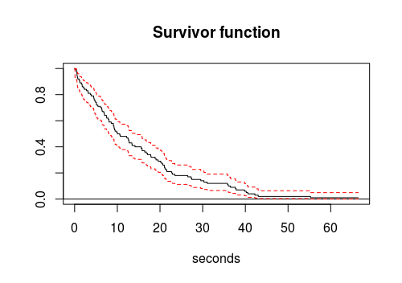

## Definitions

**Survival Function**  
It is the survival probability given a point of time, so it is a function monotically decreasing in the range [0,1]. It can be estimated with the [Kaplan Meier](https://en.wikipedia.org/wiki/Kaplan%E2%80%93Meier_estimator) estimator:

\\[\hat{S}(t) = \prod_{t_i \leq t}\frac{n_i-d_i}{n_i} \\]

Where $$n_j$$ is the original population at risk at time $$t_j$$, and $$d_j$$ is the number of events that happen to that population at $$t_j$$. This formula is equivalent to:
\\[\hat{S}(t) = \prod_{t_i \leq t}\left(1-\hat{h}(t_i)\right) \\]
where $$\hat{h}(t)$$ is the estimator of the *hazard function*.


The variance of this estimator can be calculated with the *Greenwood's formula*:

\\[Var[\hat{S}(t)]=\hat{S}(t)^2\sum_{t_i \leq t}\frac{d_i}{n_i·(n_i-d_i)} \\]


There is a matrix version of the Kaplan Meier estimator called the [Aalen-Johansens estimator](https://cran.r-project.org/web/packages/survival/vignettes/compete.pdf). It can be used to estimate the tranition probability matrix of a Markov process with a finite number of states. 


**Density Function**  
It is defined as the minus derivative of the *survival function*. The probability of happening event at time t, it is an *unconditional probability*: 
\\[f(t)=-\frac{\partial}{\partial t}S(t),\; \;   t>0 \\]

**Hazard function**  
Also known as the *incidence function*, measures the risk of having an event in a short interval $$[t,t+\Delta t]$$ inmediately after $$t$$ given that is has survived up to $$t$$. Given that there has no be an event until time $$t$$, it measures the probability of an event at time t. It is conventionally denoted by $$\lambda(t)$$ or $$h(t)$$:
\\[\lambda(t)=h(t)=\lim_{\Delta t\rightarrow 0}\frac{P(t \leq T <t+\Delta t) | T \geq t)}{\Delta t}=
\lim_{\Delta t\rightarrow 0}\frac{P(t \leq T <t+\Delta t)}{\Delta t·S(t)}=\frac{f(t)}{S(t)}\\]

In the *continuous* realm this function can have any value greater than 0, but in the *discrete* domain its value is between 0 and 1. 
which means that to experience an event at $$t$$ you first have to survive to that time. This is a difference with the density function which is an *unconditional* probabilty while the hazard function is *conditional*.
In the *discrete* time the hazard function is defined as:
\\[\hat{h}[t_i] = \frac{d_i}{n_i} \\]
with $$d_{i}$$ the number of events at $$t_{i}$$ and $$n_{i}$$ the total individuals at risk at time $$t_{i}$$.

**Cumulative hazard function**  
It is the integral of the *hazard function*:  
\\[H(t)=\int_{0}^{t}{h(s)ds}\;,\;t\geq 0 \\]

The non-parametric estimator [Nelson–Aalen](https://en.wikipedia.org/wiki/Nelson%E2%80%93Aalen_estimator) can approach this function by:
\\[\hat{H}[t]=\sum_{t_i \leq t}\frac{d_i}{n_i}\;,\;t\geq 0 \\]  
with $$d_{i}$$ the number of events at $$t_{i}$$ and $$n_{i}$$ the total individuals at risk at time $$t_{i}$$.


**Cumulative incidence**  
Probability that a particular event has ocured before a given time.
\\[CI(t)= \int_{0}^{t}{f(s)ds} = \int_{0}^{t}{S(s)\lambda(s)ds} \;,\;t\geq 0 \\]


## Function examples


### Exponential distribution
The [exponential distribution](https://en.wikipedia.org/wiki/Exponential_distribution) is used when we have a constant event rate over the time, this means that the probabilty to have an event will not depend on when the past. This means that there is no aging. In this case the *hazard function* will be constant:
\\[h(t)=\lambda,\;\;\lambda> 0 \\]
And the *cumulative hazard* function is:
\\[H(t)=\int_{0}^{t}{h(s)ds}=t·\lambda,\;\;\;\lambda> 0,t\geq 0 \\]
The *survival function* and the *density function* can both be calculated solving the following differential equation:
\\[f(t)=-\frac{\partial}{\partial t}S(t)=S(t)·h(t)=S(t)·\lambda\\]
\\[S(t)=e^{-\lambda t}\\]
\\[f(t)=-\frac{\partial}{\partial t}S(t)=\lambda·e^{-\lambda t}\\]

Always for $$\lambda> 0,t\geq 0 $$. 
The [poisson distribution](https://en.wikipedia.org/wiki/Poisson_distribution) express the possibiility of a given number of efents ocurring in a fixed time interval if these events occur with a known time indepentend average (this time independent means exponential distribution). This means that the time that happens between events which are following a *poisson distribution*.


### Rayleigh distribution
The [rayleigh distribution](https://en.wikipedia.org/wiki/Rayleigh_distribution) arise when we have a linear *aging rate*. For example:
\\[h(t)=\lambda·t,\;\;\lambda> 0,t\geq 0 \\]
Then the *cumulative hazard* function is:
\\[H(t)=\int_{0}^{t}{h(s)ds}=\frac{\lambda}{2}t^2,\;\;\;\lambda> 0,t\geq 0 \\]
As in the previous case the *survival function* and the *density function* can both be calculated solving the following differential equation:
\\[f(t)=-\frac{\partial }{\partial t}S(t)=S(t)·h(t)=S(t)·\lambda · t\\]
\\[S(t)=e^{-t^2·\lambda/2}\\]
\\[f(t)=-\frac{\partial}{\partial t}S(t)=\lambda·t·e^{-t^2·\lambda/2}\\]

Always for $$\lambda> 0,t\geq 0 $$. Where $$f(t)$$ is a rayleigh function


### Weibull distribution
The [weibull distribution](https://en.wikipedia.org/wiki/Weibull_distribution) is a generalization of the exponential and the rayleigh distribution. The *density function* has the following form:
\\[f(t)=\lambda·k(\lambda·t)^{k-1}·e^{-(\lambda t)^k},\;\;\;\lambda> 0,t\geq 0 \\]
And the *survival function* is:
\\[S(t)=e^{-(\lambda t)^k},\;\;\;\lambda> 0,t\geq 0 \\]
So the *hazard function* is:
\\[h(t)=\frac{f(t)}{S(t)}=\lambda·k(\lambda·t)^{k-1},\;\;\;\lambda> 0,t\geq 0  \\]
where $$k$$ is the shape parameter and $$1/\lambda$$ is the scale parameter of the distribution. So looking at the *hazard function* we can see how the $$k$$ parameter affects the time to failure:
* A value **k<1** indicates that the hazard function decreases with time, it is a monotonically decreasing function, this means that we have *infant mortality*. As long as time increases the time to failure decreases.
* A value **k=1** means that the hazard function is constant. This is the case of an exponential function.
* A value **k>1** means that the hazard function increases monotonically with time. This happens if there is an *aging* process. There is a particular case for **k=2** where the *weibull distribution* is equal to a *rayleigh distribution*.


 
## Parameter estimation

### Weibull estimation

Imagine that we want to simulate the decay of a radioactive sample which its [half-life](https://en.wikipedia.org/wiki/Half-life) is 10s, this implies that the decay constant is $$\lambda=\frac{ln(2)}{t_{1/2}}=0.06931$$. We can simulate the time it takes to an event to happen with the exponential probabilitistic function in R:
```R
> df<-data.frame(interval=rexp(100,rate=log(2)/10),event=1)
```
Then we can plot the survival function, that is the percentage of original elemets that we have after t seconds:
```R
> library(eha)
> plot(Surv(df$interval,df$event),fn="surv",xlab="seconds")
```


Assuming that it is a *weibull function* we can try to extract the parameters for the scale ($$1/lambda$$) and the shape (k):
```R
> library(survival)
> fit<-phreg(formula=Surv(interval,event)~1,data=df,dist="weibull")
> exp(fit$coefficients)
log(scale) log(shape) 
 15.058067   1.051323 
``` 
which is near the real values of $$1/\lambda=14.42$$ and $$k=1$$.


