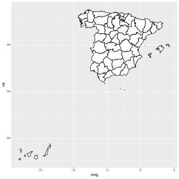
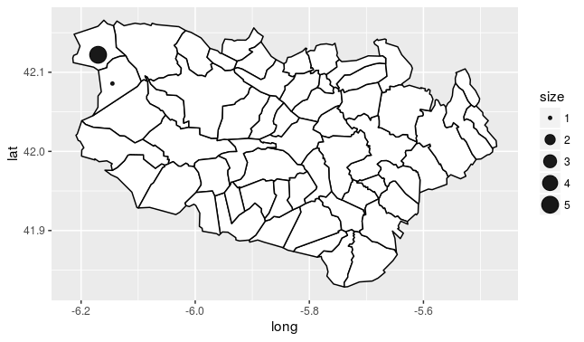
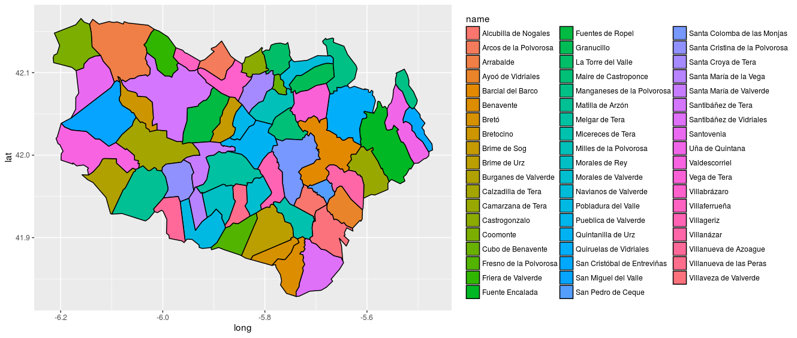

## Maps with ggplot

You need the maptools package which allows you to import packages

Download the map from:
http://www.gadm.org
Download in format Shape Poly.

library(ggplot2)
library(maptools)

mapSpain<-readShapePoly("/home/jmgonzalezc/Documents/PredictiveAnalysis/Valencia/maps/ESP_adm3.shp")

Prepare to show the provices by ggplot:

gpclibPermit()
sp<-fortify(map_spain, region="NAME_2")
ggplot(sp,aes(x=long,y=lat,group=group))+geom_polygon(colour='black', fill='white')

ggsave("mapSpain.png")

If we want to plot 

mapZamora<-mapSpain[mapSpain$NAME_2=="Zamora",]
mZ<-fortify(mapZamora)
ggplot(mZ,aes(x=long,y=lat,group=group))+geom_polygon(colour='black', fill='white')

Now let's say that we want to plot all the villages in the comarc of "Valle de vidriales". First we need to load a new map with villages information. Then we filter by the comarc ID.
mapSpain<-readShapePoly("/home/jmgonzalezc/Documents/PredictiveAnalysis/Valencia/maps/ESP_adm4.shp")
mapVidriales<-mapSpain[mapSpain$ID_3==185,]
mV<-fortify(mapVidriales)
ggplot(mV,aes(x=long,y=lat,group=group))+geom_polygon(colour='black', fill='white')

We can plot points of different sizes in "Uña de Quintana" and in "Cubo de Benavente":
pts<-data.frame(lat=c(42.0857385,42.1220553),lon=c(-6.1450838,-6.1701778),size=c(1,5))
ggplot(mV,aes(x=long,y=lat,group=group))+
geom_polygon(colour='black',aes(fill=name))+
geom_point(data = pts, aes(y=lat,x=lon,size=size,group=1), alpha=0.9)

If we want to colour each village with a different color and a label simply. The purpose of this line is to show to use merge to color the maps, no t to make a readable map:
mV2<-merge(mV,data.frame(id=mapVidriales$ID_4,name=mapVidriales$NAME_4),by=c("id"))
ggplot(mV2,aes(x=long,y=lat,group=group))+
geom_polygon(colour='black',aes(fill=name))

## Interactive google maps

loc$address<-factor(sapply(loc$city,function(x) paste(x,", Valencia",sep="")))
	loc$city<-sapply(loc$address,function(x) paste("<b>",x,"</b>"))
	loc$mapNoteTxt<-mapNoteTxt
	map<-gvisMap(loc,locationvar="address",tipvar="mapNoteTxt",options=list(showTip=TRUE, showLine=TRUE, enableScrollWheel=TRUE, mapType='terrain', useMapTypeControl=TRUE, height=700))
	plot(map)	
